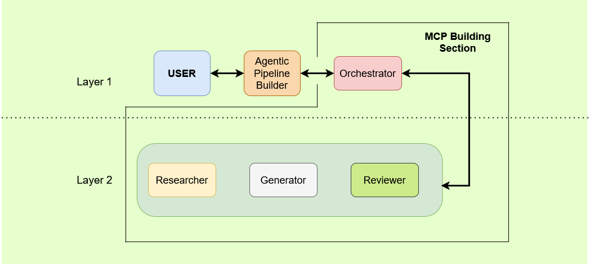

# Agentic AI for AAS-Based Data Pipeline Generation in Industry 4.0

[](https://opensource.org/licenses/MIT)
[](https://www.python.org/downloads/)

An Asset Administration Shell (AAS) approach for representing, generating, and deploying industrial data pipelines using agentic workflows and the Model Context Protocol (MCP).

---

## Abstract

Industrial data pipelines are essential for transforming heterogeneous shop-floor data into usable information, yet their engineering remains predominantly manual and difficult to reuse across changing manufacturing environments. Engineers must repeatedly interpret asset capabilities, redefine data transformations, configure storage and processing services, and maintain these configurations as industrial systems evolve. This lack of machine-interpretable pipeline models restricts interoperability, increases deployment effort, and limits the adaptability expected from Industry 4.0 systems. This paper presents an Asset Administration Shell (AAS) approach for representing, generating, and deploying industrial data pipelines. First, it extends existing data management AAS submodels with a reusable data-pipeline model structured around collection, integration, preprocessing, storage, processing, and utilization stages. Second, it introduces an agentic workflow that interprets AAS-described assets through an AAS Model Context Protocol server. Third, it formulates pipeline configurations, validates execution plans with human supervision, and deploys the required software components. A containerized prototype demonstrates the creation, deployment, reuse, and extension of pipelines connecting robotic, messaging, storage, and visualization components. By treating data pipelines as first-class AAS artefacts, the proposed approach establishes a semantic foundation for more interoperable, reusable, and human-supervised industrial data engineering.

---

## Architecture Overview

The system follows a two-layer agentic architecture divided into two parts: an Agentic Pipeline Builder and an MCP Building Section.



* **Layer 1 (Interaction & Directing):** The user interacts directly with the **Agentic Pipeline Builder**, which is responsible for interacting with the user and the AAS to build and deploy data pipelines, while also communicating with the **Orchestrator** inside the MCP building environment to build new MCP infrastructure.
* **Layer 2 (Execution & Refinement):** The **Orchestrator** manages dedicated sub-agents:
  * **Researcher:** Performs web search to gather additional information that supplements the AAS and gives a fuller picture to the next agent.
  * **Generator:** Formulates MCP infrastructure for represented AAS assets that lack a dedicated MCP server, enabling deployment.
  * **Reviewer:** Validates the generated MCP code and makes improvement suggestions.

## Getting Started

### Prerequisites

- Docker
- Python 3.10+
- `uv` package manager (recommended)

### 1. Launch Infrastructure Services

Clone the repository and bring up the containerized infrastructure (BaSyx, Kafka, MongoDB, SearXNG, etc.):

```bash
# Clone the repository
git clone https://github.com/NOVA-RICS-Open-Lab/agentic-data-pipelines.git
cd agentic-data-pipelines

# Copy environment template if needed
cp .env.example .env  # Configure your API keys (OPENAI_API_KEY, etc.)

# Launch all Docker services
docker compose --profile http up -d
```


### 2. Agent Interaction

Once started, open your browser at **`http://localhost:8000`** to interact with the Agentic Pipelines system.

---

## Contributing

Contributions are welcome! To propose a change:

1. Fork the repository and create a feature branch (`git checkout -b feature/your-feature`).
2. Commit your changes with clear messages.
3. Open a Pull Request describing what you changed and why.

For larger changes, please open an issue first to discuss the direction. Bug reports and feature requests are also welcome via the [issue tracker](https://github.com/NOVA-RICS-Open-Lab/agentic-data-pipelines/issues).

## Citation

If you use or build on this work, please cite:

```bibtex
@mastersthesis{miranda2026agentic,
  author  = {Miranda, João and Pegado, António and Freitas, Nelson and Rocha, André and Barata, José},
  title   = {Agentic AI for AAS-Based Data Pipeline Generation in Industry 4.0},
  school  = {NOVA School of Science and Technology},
  year    = {2026}
}
```

## License

This repository is released under the MIT License. See the [LICENSE](LICENSE) file for details.

## Contacts

For questions about this or other projects, contact us at [novaricsopenlab@gmail.com](mailto:novaricsopenlab@gmail.com) or join our [Discussion Forum](https://github.com/NOVA-RICS-Open-Lab/agentic-data-pipelines/discussions).